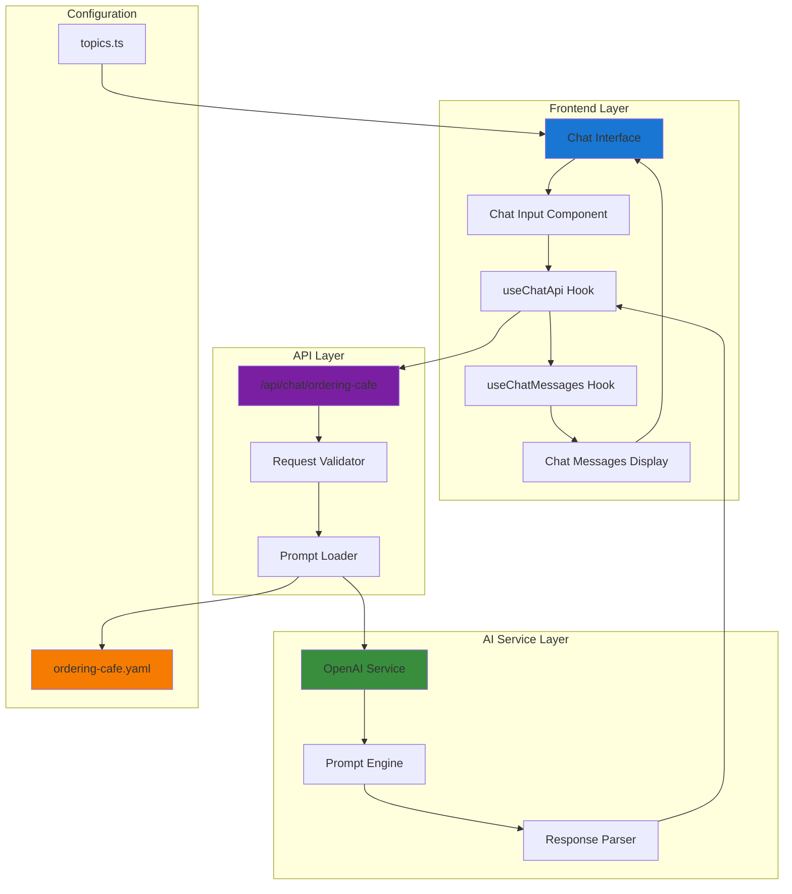
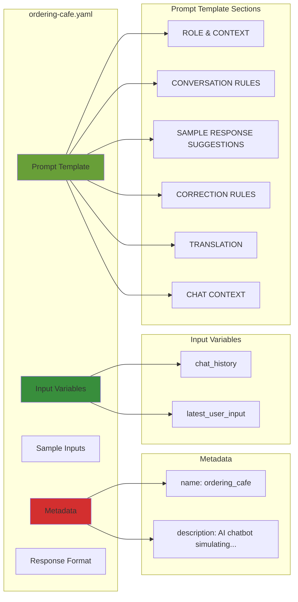
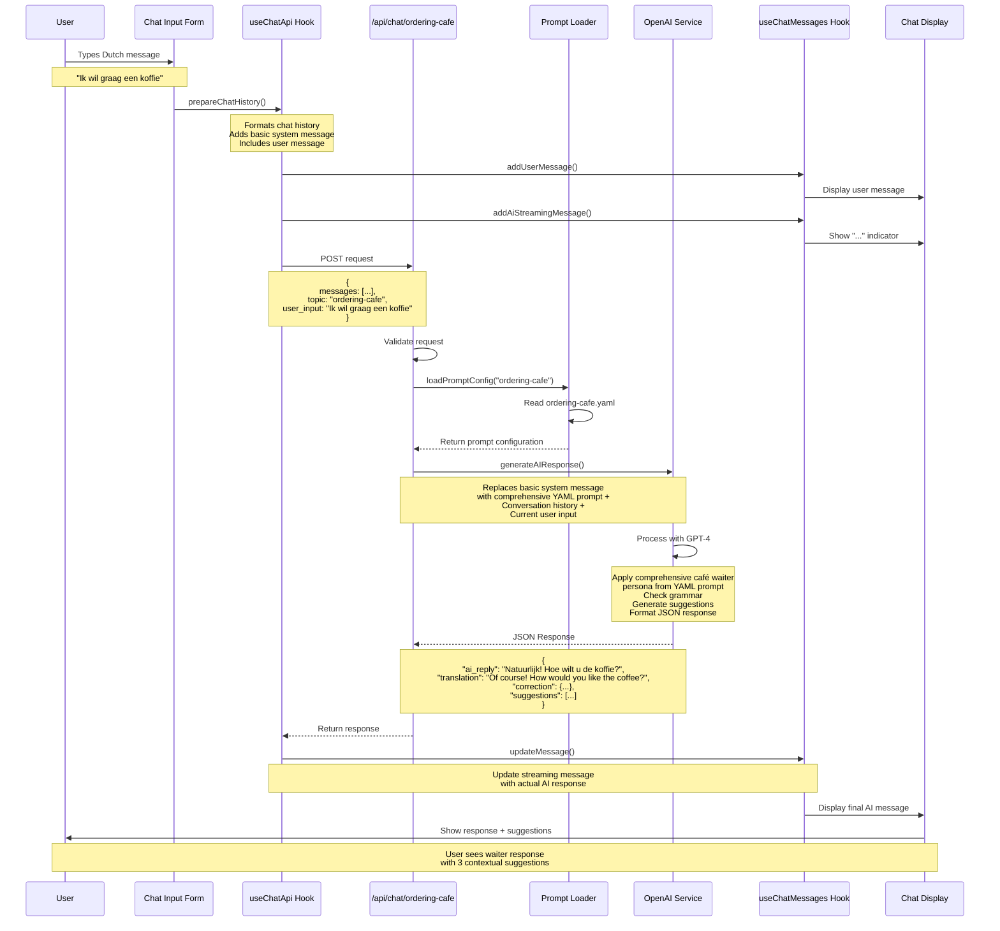
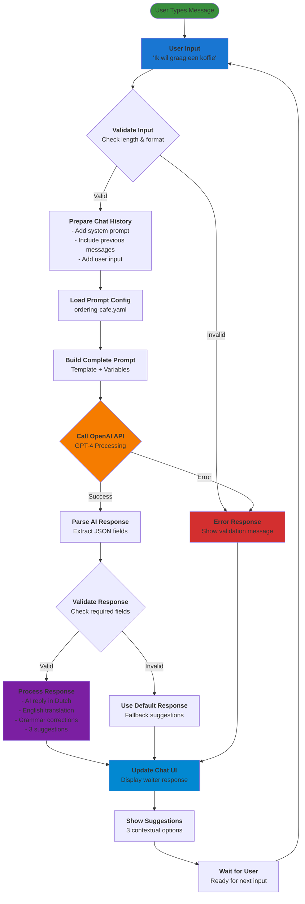
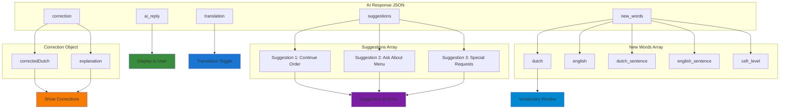
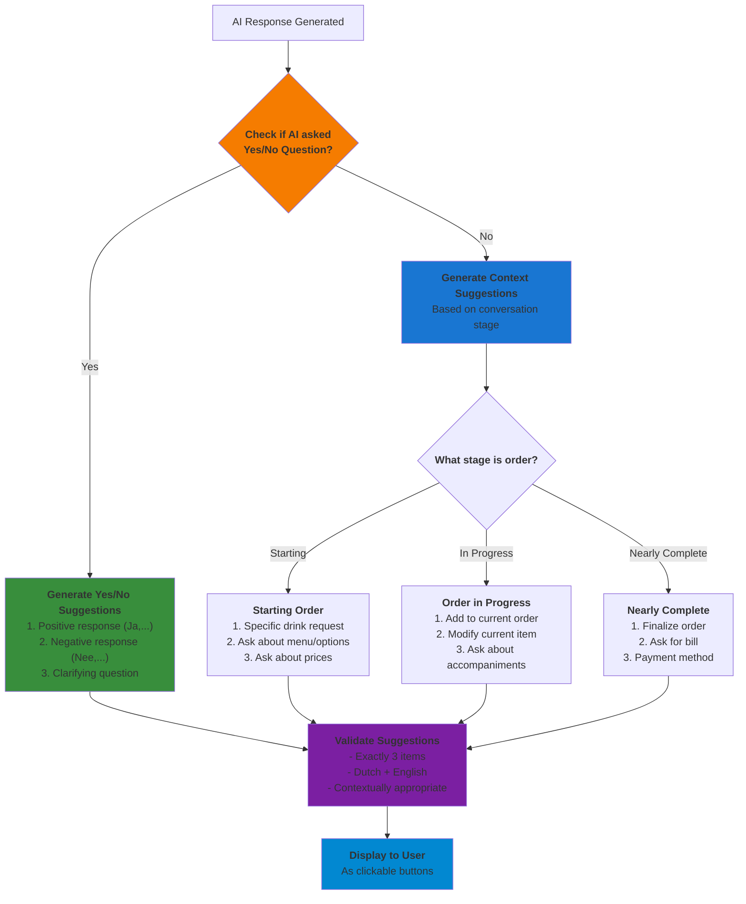
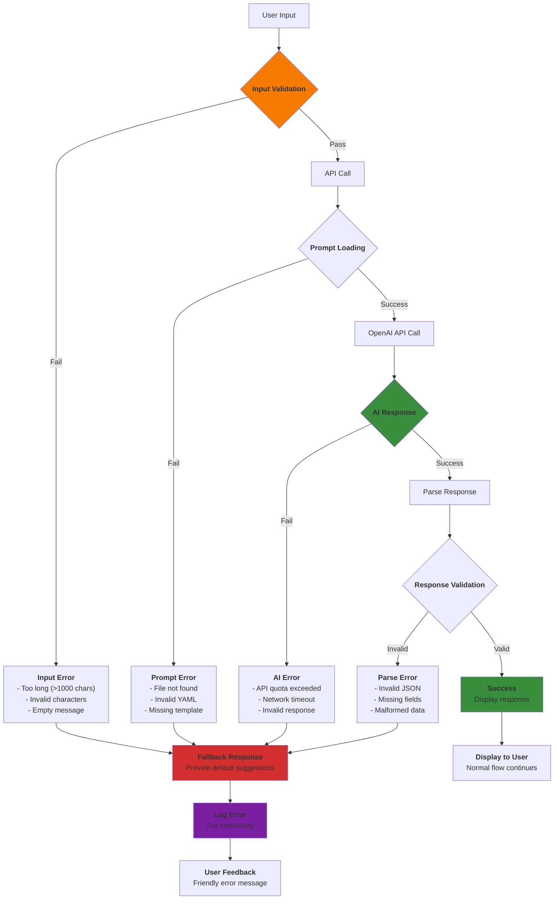

# Ordering at a Café - Prompt System Documentation

## Overview

This document provides an extensive explanation of how the "Ordering at a Café" scenario works in the Dutch Chat Application, including the complete prompt flow, response handling, and system architecture with detailed Mermaid diagrams.

## Table of Contents

1. [System Architecture](#system-architecture)
2. [Prompt Configuration](#prompt-configuration)
3. [Message Flow Sequence](#message-flow-sequence)
4. [Data Flow Architecture](#data-flow-architecture)
5. [Response Processing](#response-processing)
6. [Error Handling](#error-handling)
7. [User Experience Flow](#user-experience-flow)
8. [Implementation Details](#implementation-details)

---

## System Architecture

The café ordering system follows a multi-layered architecture that separates concerns between the frontend React components, API layer, and AI service.



---

## Prompt Configuration

The café ordering scenario is configured through a comprehensive YAML file that defines the AI's behavior, correction rules, and response format.

### YAML Structure Breakdown



### Key Configuration Elements

#### Role Definition
- **Character**: Friendly Dutch waiter
- **Setting**: In-person café service
- **Language Level**: A1-A2 Dutch
- **Response Length**: 1-2 short sentences

#### Conversation Rules
1. **Memory**: Remember previous orders
2. **Progression**: Don't repeat questions
3. **Natural Flow**: Suggest related items when appropriate
4. **Context Awareness**: Continue based on order status

#### Correction Guidelines
- **Never Correct**: Punctuation, capitalization, spacing
- **Only Correct**: Grammar/vocabulary affecting understanding
- **Examples Provided**: Specific correction scenarios

---

## Message Flow Sequence

This sequence diagram shows the complete flow from user input to AI response in the café ordering scenario.



---

## Data Flow Architecture

This flowchart illustrates how data flows through the system components during a café ordering interaction.



---

## Response Processing

The AI response goes through multiple processing stages to ensure consistency and quality.

### Response Structure



### Suggestion Logic

The system provides exactly 3 contextual suggestions based on the conversation state:



---

## Error Handling

The system includes comprehensive error handling at multiple levels:



---

## User Experience Flow

This diagram shows the complete user journey through a café ordering conversation:

```mermaid
sequenceDiagram
    participant U as User
    participant C as Chat Interface
    participant W as AI Waiter
    
    Note over U,W: Café Ordering Conversation Flow
    
    W->>C: "Hallo! Welkom. Wat mag het voor u zijn?"
    C->>U: Display greeting + 3 suggestions
    Note over C,U: 1. "Ik wil graag een koffie"<br/>2. "Heeft u appeltaart?"<br/>3. "Mag ik de kaart, alstublieft?"
    
    U->>C: Clicks suggestion: "Ik wil graag een koffie"
    C->>W: Send message
    
    W->>C: "Natuurlijk! Hoe wilt u de koffie?"
    C->>U: Display response + new suggestions
    Note over C,U: 1. "Met melk, alstublieft"<br/>2. "Zwart, zonder suiker"<br/>3. "Wat voor koffie heeft u?"
    
    U->>C: Types: "met melk graag"
    C->>W: Send message
    Note over W: Check grammar: ✓ No correction needed
    
    W->>C: "Prima! Wilt u er ook iets bij?"
    C->>U: Display response + suggestions
    Note over C,U: 1. "Ja, een stuk appeltaart"<br/>2. "Nee, alleen koffie"<br/>3. "Wat heeft u allemaal?"
    
    U->>C: Clicks: "Ja, een stuk appeltaart"
    C->>W: Send message
    
    W->>C: "Uitstekend! Dat is een koffie met melk en appeltaart."
    C->>U: Display response + final suggestions
    Note over C,U: 1. "Dat klopt"<br/>2. "Mag ik de rekening?"<br/>3. "Hier of mee naar huis?"
    
    U->>C: Clicks: "Mag ik de rekening?"
    C->>W: Send message
    
    W->>C: "Natuurlijk, dat is €6,50 samen."
    C->>U: Display final response
    
    Note over U,W: Conversation Complete ✓
```



---

## Implementation Details

### Hook Architecture

The system uses two main React hooks that work together:

#### useChatApi Hook

```typescript
// Manages API interactions
const { sendMessage, checkGrammar, prepareChatHistory } = useChatApi()

// prepareChatHistory function structure:
// This adds a basic system message, but the main prompt comes from the YAML file
const prepareChatHistory = (messages, currentTopicTitle, newMessage) => {
  return [
    {
      role: 'system',
      content: `You are a helpful assistant helping someone learn Dutch. The current topic is: ${currentTopicTitle}.`
    },
    ...messages
      .filter(msg => msg.role === 'user' || !msg.isStreaming)
      .map(msg => ({
        role: msg.role === 'user' ? 'user' : 'assistant',
        content: msg.role === 'user' ? msg.dutch : msg.dutch
      })),
    {
      role: 'user',
      content: newMessage
    }
  ]
}

// Note: The comprehensive system prompt from ordering-cafe.yaml 
// is actually added later in the OpenAI service layer
```

#### useChatMessages Hook

```typescript
// Manages message state and UI operations
const {
  messages,
  addMessage,
  updateMessage,
  toggleTranslation,
  toggleCorrections,
  addUserMessage,
  addAiStreamingMessage
} = useChatMessages()
```

### API Route Processing

The API route follows this processing pattern:

```mermaid
flowchart LR
    Request["`**HTTP Request**
    POST /api/chat/ordering-cafe`"] --> Parse["`**Parse Body**
    Extract messages & user_input`"]
    
    Parse --> Validate["`**Validate Data**
    Check message format`"]
    
    Validate --> LoadConfig["`**Load Prompt Config**
    ordering-cafe.yaml`"]
    
    LoadConfig --> PreparePrompt["`**Prepare Prompt**
    Template + Variables`"]
    
    PreparePrompt --> CallOpenAI["`**Call OpenAI**
    Generate response`"]
    
    CallOpenAI --> FormatResponse["`**Format Response**
    Structure JSON output`"]
    
    FormatResponse --> Return["`**Return Response**
    Send to frontend`"]
    
    style Request fill:#1976d2
    style LoadConfig fill:#f57c00
    style CallOpenAI fill:#388e3c
    style Return fill:#0288d1
```



### Prompt Template Variables

The system replaces these variables in the YAML template:

- `{{chat_history}}`: Previous conversation messages
- `{{latest_user_input}}`: Current user message

### System Prompt Integration

**Important Note**: The comprehensive system prompt is NOT added in the `prepareChatHistory` function. Instead, it's added in the OpenAI service layer:

```typescript
// In lib/openai-service.ts - generateAIResponse function:
const systemPrompt = promptConfig.template  // This is the full YAML template

const systemMessage = {
  role: 'system',
  content: systemPrompt + '\n\nPlease respond with a valid JSON object.'
}

// The final message array sent to OpenAI:
const messages = [
  systemMessage,  // <-- The comprehensive prompt from YAML
  ...conversationHistory  // <-- User/assistant messages from prepareChatHistory
]
```

This means:
1. **Frontend**: `prepareChatHistory` adds basic conversation structure
2. **API Layer**: Loads YAML prompt configuration  
3. **OpenAI Service**: Replaces the basic system message with the comprehensive YAML prompt
4. **Result**: OpenAI receives the full café waiter persona and instructions

### Response Validation

Every AI response is validated for:

1. **Required Fields**: `ai_reply`, `translation`, `correction`, `suggestions`
2. **Suggestion Count**: Exactly 3 suggestions
3. **Suggestion Format**: Each with `dutch` and `english` properties
4. **JSON Structure**: Valid JSON format
5. **Content Quality**: Non-empty responses

---

## Conclusion

The "Ordering at a Café" prompt system demonstrates a sophisticated approach to language learning through interactive conversations. The system combines:

- **Contextual AI Responses**: Realistic waiter behavior
- **Educational Features**: Grammar correction and vocabulary building
- **User-Friendly Interface**: Suggestion-based interactions
- **Robust Error Handling**: Graceful failure management
- **Scalable Architecture**: Easy to extend to new scenarios

This documentation provides the foundation for understanding, maintaining, and extending the café ordering system within the broader Dutch chat application.
